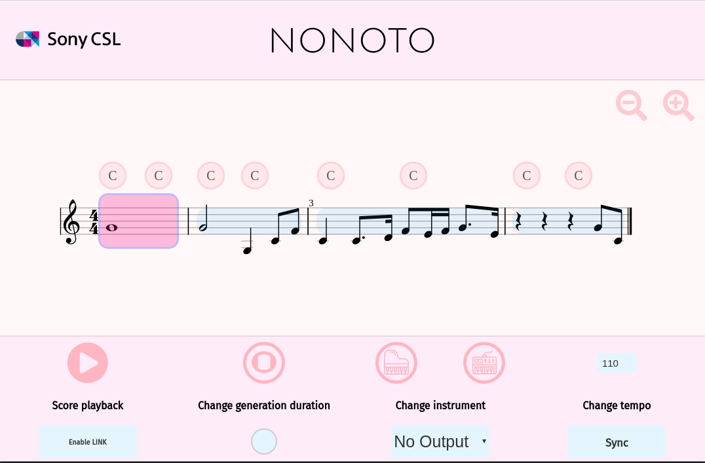

NONOTO is an A.I.-powered interactive score. It allows users to interact intuitively with any 
existing music composition algorithm. In order to make this programme used by a majority of 
artists, we 
provide a way to integrate seamlessly NONOTO within 
[Ableton Live](https://www.ableton.com/en/live/), and more generally, to any Digital Audio Workstation supporting 
[Ableton Link](https://www.ableton.com/en/link/).

NONOTO is distributed as an [Electron](https://electronjs.org/) app and as a web application. 
Currently, only the Electron application (for Linux and MacOS) can be connected to another DAW. 

## Installation

## Electron application
*Recommended*

You can download the MacOS and Linux standalone applications 
[here](https://github.com/SonyCSLParis/NONOTO/releases).

 
## Web application
### Docker
A Docker image for NONOTO is available on [Docker Hub](https://hub.docker.com/), so that you can download and launch the 
NONOTO server with:
```
docker run -it -p 8080:8080 nonoto
```
and then connect to 127.0.0.1:8080.

### Manual installation
Install the [OpenSheetMusicDisplay fork](https://github.com/SonyCSLParis/opensheetmusicdisplay) 
which allows to have access to internal private variables such as the displayed elements: 
```
cd INSTALL_DIR
git clone https://github.com/SonyCSLParis/opensheetmusicdisplay.git
cd opensheetmusicdisplay
yarn install && yarn link
```

Install our [Simplebar fork](https://github.com/SonyCSLParis/simplebar):
```
cd INSTALL_DIR
git clone https://github.com/SonyCSLParis/simplebar.git
cd simplebar
yarn install && yarn run build && yarn link
```

Finally, install NONOTO with
```
cd INSTALL_DIR
git clone https://github.com/SonyCSLParis/NONOTO.git
cd NONOTO
yarn link opensheetmusicdisplay && yarn link simplebar
RUN yarn install && yarn build:web
```

Once, this is done, the NONOTO server is can be started with
```
yarn serve:web
```
then, connect to 127.0.0.1:8080.

By default, NONOTO uses the port 8080. We recommend to use Chrome.

# Usage

Different modes are available:
- *Folk songs mode* works with any type of score and allows the user to regenerate any part of 
the score by clicking on it,
- *Chorale mode* adds a way to control *fermatas* (indication of where the musical phrases 
end in Bach chorales) 
- *Leadsheet mode* adds a way to control and set chord progressions.



## Starting a music composition algorithm server

NONOTO is just an interface which allows users to query music composition algorithm 
You need to start a backend server. 

For the moment, only the integration with 
[DeepBach](https://github.com/Ghadjeres/DeepBach/tree/master#usage-with-nonoto) is provided.
Integration with other music composition algorithms will be available soon.

## Connexion with Ableton
TODO 

## Issues
An up-to-date version of libstdc++6 may be needed to run the linux AppImage. 
```
sudo add-apt-repository ppa:ubuntu-toolchain-r/test
sudo apt-get update
sudo apt-get upgrade libstdc++6
```
