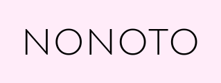

# NONOTO / NOTONO



NOTONO is an A.I.-powered sound editor. It allows users to edit sound in a graphical, Paint-like approach.

NONOTO is distributed as an [Electron](https://electronjs.org/) app and as a web application.

## Installation

### Manual installation

We recommended using the `nvm` installation manager for Node.js, available
[here](https://github.com/nvm-sh/nvm#installing-and-updating).
NONOTO/NOTONO is currently developed with Node.js version `14.5.0`.

We use the `yarn` package manager, you can install it [here](https://classic.yarnpkg.com/fr/docs/install/).

NONOTO can then be installed as follows:

```sh
git clone https://github.com/SonyCSLParis/NONOTO.git
cd NONOTO
git checkout spectrogram
yarn install
```

Once, this is done, the NONOTO dev server (an Electron app with live-reloading) can be started with

```sh
yarn dev
```

Alternatively, a web server can be created to serve the application over http:

```sh
yarn build:notono_web
yarn serve:web
```

By default, NONOTO uses the port 8080.
We recommend to use Chrome, but Firefox has been tested to work as well.

### Electron application

**Warning**: *This section is not up-to-date*

You can download MacOS and Linux standalone applications
[here](https://github.com/SonyCSLParis/NONOTO/releases).

## Configuration

Some configuration options can be set in the `config.json` file at the root of the project, to override the default configuration found in `src/common/default_config.json`.

## Issues

An up-to-date version of libstdc++6 may be needed to run the linux AppImage.

```bash
sudo add-apt-repository ppa:ubuntu-toolchain-r/test
sudo apt-get update
sudo apt-get upgrade libstdc++6
```

## Credits

Icons made by [Freepik](https://www.flaticon.com/authors/freepik) from [www.flaticon.com].
